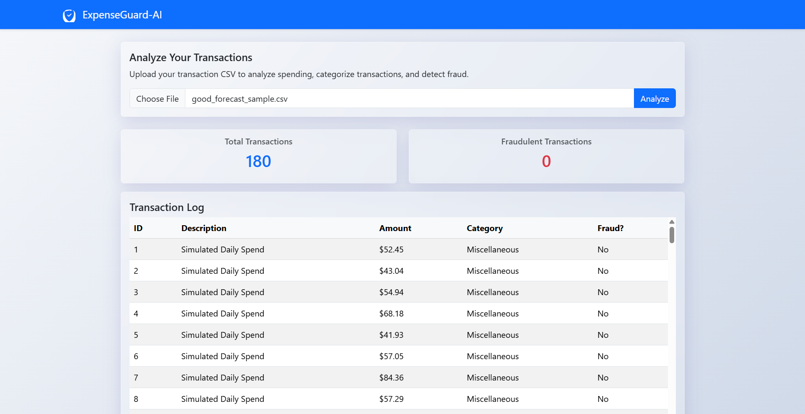

# ExpenseGuard-AI 🛡️

A full-stack, AI-powered web application for personal finance analysis, fraud detection, and spending forecasting. This project turns a simple transaction CSV into an interactive dashboard with actionable insights.

**![ExpenseGuard-AI Dashboard]**

*(**Note:** To get a URL, you can upload your screenshot to the "Issues" tab of your GitHub repo and then copy the image link.)*

## ✨ Core Features

* **📈 Interactive Dashboard:** A clean, responsive front-end built with Bootstrap 5 and Chart.js to visualize all data.
* **🤖 AI-Powered Fraud Detection:** Upload a transaction CSV and the system will use a **Random Forest** model (trained on an imbalanced dataset using SMOTE) to flag suspicious transactions in real-time.
* **🧾 Automatic Categorization:** A rule-based engine categorizes each transaction (e.g., "WALMART" -> "Groceries") to help users understand their spending habits.
* **📊 30-Day Spending Forecast:** Uses the **Prophet** time-series model to analyze spending history and generate an interactive 30-day forecast.

---

## 🛠️ Tech Stack
This project is a full-stack application combining a Python backend with a modern JavaScript front-end.

### Backend (The "Engine")
* **Python 3.10**
* **Flask:** For the web server and REST API.
* **Pandas:** For all data manipulation.
* **Scikit-learn:** For the Random Forest fraud detection model.
* **Imbalanced-learn:** For using SMOTE to pre-process the training data.
* **Prophet (by Meta):** For time-series forecasting.
* **Joblib:** For saving and loading the trained ML models.

### Frontend (The "Dashboard")
* **HTML5**
* **CSS3** (with custom Glassmorphism & Shadow styling)
* **Bootstrap 5:** For the core UI, components, and responsive layout.
* **JavaScript (ES6+):** For all client-side logic, API calls (`fetch`), and DOM manipulation.
* **Chart.js:** For rendering the beautiful 30-day forecast chart.

### Tooling
* **Git & GitHub:** For version control.
* **Jupyter Notebooks:** For all ML model prototyping and data exploration.
* **Postman:** For testing all API endpoints.

---

## 🏁 Getting Started

Here's how to get a copy of the project up and running on your local machine.

### Prerequisites

* **Python** (3.8 or newer)
* **Git**

### Installation & Setup

1.  **Clone the repo:**
    ```bash
    git clone https://github.com/BishwaThakuri/ExpenseGuard-AI.git
    cd ExpenseGuard-AI
    ```

2.  **Create and activate a virtual environment:**
    ```bash
    # On Windows
    python -m venv venv
    venv\Scripts\activate
    ```
    ```bash
    # On macOS/Linux
    python3 -m venv venv
    source venv/bin/activate
    ```

3.  **Install all required libraries:**
    ```bash
    pip install -r requirements.txt
    ```

### Running the Application

The entire application is run from the single Flask server.

1.  **Run the Flask server:**
    ```bash
    python app.py
    ```

2.  **Access the frontend:**
    Open your web browser and go to:
    **http://127.0.0.1:5000/**

You can now upload one of the sample CSVs (`good_forecast_sample.csv`) and use the application.

---

## 🗺️ API Endpoints

The Flask server provides two main API endpoints:

### `POST /upload_csv`
Processes an uploaded transaction CSV file.
* **Body:** `form-data` with a `file` key.
* **Returns (JSON):** A list of all transactions, each with a new `is_fraud` (0 or 1) and `category` (e.g., "Groceries") field.

### `POST /forecast`
Generates a 30-day spending forecast from a list of transactions.
* **Body:** `raw` JSON array of the transactions (the `all_transactions` output from the `/upload_csv` endpoint).
* **Returns (JSON):** A list of forecast data points, each with `ds` (date) and `yhat` (predicted amount).

---

## 🔮 Future Development

This project is a strong v1. Future plans to expand its capabilities include:
* **Receipt OCR:** Add a new endpoint to **upload an image of a receipt**, using **YOLOv8** and **OCR** to extract line items and categorize them individually.
* **Three.js Visuals:** Enhance the dashboard with **Three.js** 3D visualizations, such as an interactive 3D forecast chart or an animated background.
* **User Accounts:** Add a database (like **SQLite** or **PostgreSQL**) and user authentication to allow users to save their transaction history.